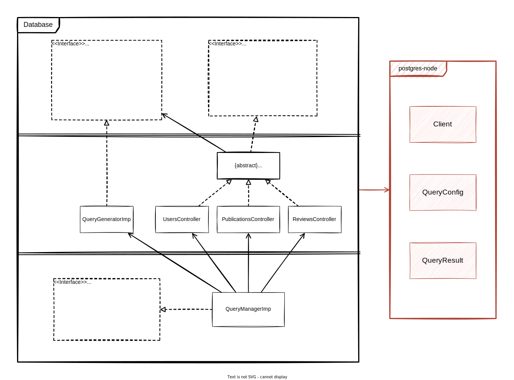
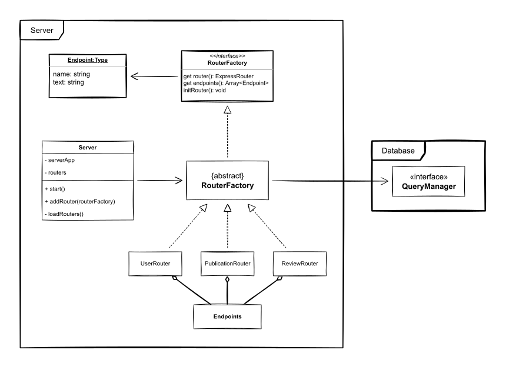

# Get Started

## NPM install
Install the dependencies by executing the following command in the root directory:
```
npm install
```

## NPM run build
This would just use the `tsc` command (TypeScript Compiler) and the `tsconfig.json` file in the root directory, in order to compile the files from `src` into JavaScript and relocate them in `dist` directory.
```
npm run build
```

## NPM run start
This command could only be used right after building. 
It executes `app.js` from `dist` directory via node.
```
npm run start
```

## NPM run test
This command could only be used right after building and installing dev dependencies. 
It tests server routers components by using mocha framework and axios.
```
npm run test
```

# Overview of The Structure

There are only two major components of the backend side: _Database_ & _Server_, each of which is located in a separete sub-directory of the backend. 

The _Database_ considered to possess the business rules of the system, that represent the overall concept behind the system: _DataContollers_ and _QueryGenerator_. The former is used to encapsulate the operations of sending queries to the Database Client. However, the latter is to avoid hard-coding the SQL queries. In addition, the component provides a full-organized and managed facility to use and access its all operations via _QueryManager_.

On the other hand, the _Server_ is a detail. It tightly coupled to Express architecture and has dependency on the _Database_, however, it has RouterFactory design that aquires the component some flexibility. Loosely speaking, if some other framework is intended to be used rather than Express, minor modifications in a few functions of _RouterFactory Abstract Class_ are supposed to be the only repercussions.

## Database Component
The _Dababase_ component is composed of three objects/collections of objects (building blocks). Each object/collection is distinguished by its level of abstraction and stability. They might be listed according to the levels, descentantly, as follows:

1. DataController & QueryGenerator 
2. DataControllerImp & QueryGeneratorImp
3. QueryManager & QueryManagerImp

_QueryGenerator_ and _DataController_ are the most stable objects in the system, they shall change only after changing the requirements. On the other hand, _DataControllerImp_ might change if the used database client (which is provided by postgres-node in our case) changed, for some reason. And _QueryGenerator_ is , as obvious, completely coupled to SQL. Meanly, it will need changes if we decided to use NoSQL in future for some reasone, or other DBMS.

Finally, _QueryManager_, the most instable object, whose only purpose is to provide the external environment with well-organised and managed facility to access all the _Database_ operations. Despite it gives the user access to client connection operations, it shall connect and disconnect the client automatically, when the user sends a query and when all queries are fulfilled, respectively.

> The component is totally coupled to postgres-node, as it explicitly uses its types objects and client. However it shall be decoupled by adding extra interfaces in future.



## Server Component
The _Server_ component is much more simple compared to the _Database_. It consists of just one major element and another two for the external environment. 

The _RouterFactory_, as mentioned previously, is coupled to Express Architecture. However, it should be trivial to port it to another architecture, by few changes in the Abstract implementation. The _RouterFactoryImp_ has dependency on the _QueryManager_ of the _Database_, in order to be able to handle users requests which certainlly requires access to the database.

The _Server_ element is used by the external environment as a container for Express Application. The user of it shall be able to start a server with custom `host` and `port`, and load it with Routers. It encapsulates the necessary initialization for express application in `start` method (using different middlewares).

Finally, the _Endpoint_ purpose is to share the implemented endpoints by the routers with the frontend client. It facilitate sending requests, by encapsulating the path parameters and generate it with pre-defined functions.




## Directory Structure

the structure of "src" directory may be visualized as follow:
```
./src
├── app.ts
├── database
│   ├── DataController
│   │   ├── controllers
│   │   │   ├── PublicationsController.ts
│   │   │   ├── ReviewsController.ts
│   │   │   └── UsersController.ts
│   │   ├── DataControllerImp.ts
│   │   └── DataController.ts
│   ├── postgresql
│   │   ├── initConstraints.sql
│   │   ├── initFunctions.sql
│   │   ├── initRelations.sql
│   │   ├── init.sh
│   │   ├── initTriggers.sql
│   │   ├── startservice.sh
│   │   └── stopservice.sh
│   ├── QueryGenerator
│   │   ├── QueryGeneratorImp.ts
│   │   └── QueryGenerator.ts
│   └── QueryManager
│       ├── QueryManagerImp.ts
│       └── QueryManager.ts
└── server
    ├── Endpoints
    │   ├── Collections
    │   │   ├── PublicationEndpoints.ts
    │   │   ├── ReviewEndpoints.ts
    │   │   └── UserEndpoints.ts
    │   ├── index.ts
    │   └── type.ts
    ├── RouterFactory
    │   ├── factories
    │   │   ├── PublicationRouterFactory.ts
    │   │   ├── ReviewRouterFactory.ts
    │   │   └── UserRouterFactory.ts
    │   ├── Responses.ts
    │   ├── RouterFactoryImp.ts
    │   └── RouterFactory.ts
    └── Server.ts
```
