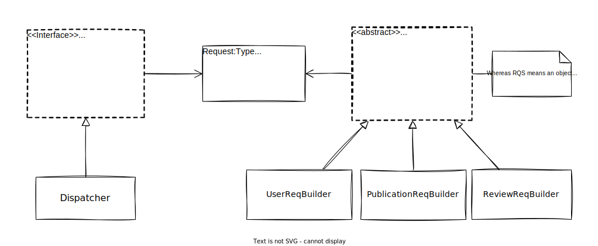

# Inception

A three straightforward issues ought to take all of our concern while developing the frontend. The first is about the UI; we need to provide a well-organized and sophisticated tool that can deal, eligibly, with drawing different UI views for the user. The second is about state management; where the whole application data (user_info, products_list,...etc) is stored, and different data-related mechanisms are marshaled. The third is about Server Communications; the bridge that makes it possible for the frontend to communicate with the backend in a comprehensive and flexible manner. 

In the following sections, we shall describe and specify these three design components: _UIPainter_, _StateManager_, and _RequestDispatcher_; which are going to solve the three issues mentioned above, respectively.

# StateManager

StateManager takes the full responsibility to store various application data, and to provide its access and update facilities. This component ought to be the most stable among the others, and as abstract as possible; it considered to carry out the business rules: it must NOT depend on other components and must define a general reusable design that can implement the business rules and cope to their future changes.

Generally, storing and manipulating any kind of data requires defining two objects; one descibes the structure of the data units, and the other declares the features — the methods that could be applied to the data. We shall give the both names: _Entity_ and _Controller_.

Nevertheless, this pair is not adequate for defining a StateManager, they are lack of management. An additional object shall be described in order to manage this entity-controller environment; by giving the users (other components) the suitable facilities to create Entities and take controll over any ones features.

## Entity

It's just an object with three attributes: one of them is a unique key which identifies a specific unit of data, another is a cache value which could be used by the controller to avoid unnecessary overhead computations if possible, and finally the third is the value to be stored which could be of any type (it even could be another StateManager).

The cache could be used, for instance, to decide whether to update a big list of publications or not, by comparing the length of the list with the number of current publications retrieved from the database. Moreover, the generality in the Entity value attribute gives StateManagers a nesting property; whereas each StateManager could contain more than one Entity in which another StateManager is stored. And this property will be profusely used in "Implemented Components" section in which we will define a tree of components that represents and illustrates the whole application state.

## Controller

A Controller controls the Entity (the specific contructed type) that associated to the same StateManager. It must not care about any thing rather than manipulating the entity value; it must not know about update callbacks or cache values. It only knows, at least, how to read, update, and remove the Entity value attribute.

Reading the value could simply be returning it, parsing it as a string or JSON first, or even reconstruct it to a specific more complex form then returning it. Updating the value sould replace the entire value attribute with a new object adhering the structure in the specified Entity object. Removing the value is just replacing it with NULL, it might be needed (in saving space) as the overall state could be saved in and loaded from local storage.

## AppState

A state is defined by a set of entities and a controller that's compatible with the structure of the entities. A State object is responsible to invoke the controller methods in order to manipulate the entities, and to store, remove, and invoke callbacks, as well.

In addition, it should give the user a method to get the state (the set of entities) compiled into one JS object with the proper values been evaluated; if one of the entities is just another StateManager, then it must be compiled in turn as well.

## Implemented Components

From the abstract component StateManager, we can inherit and implement as many as our need of states requires for different aspects in the system. Mainly, we shall define a root state with the default implementations associated to it, after that, and for the sake of global-store, we're going to derive three StateManagers from the root: UserSM, PublicationSM, and ReviewSM, and from each of these SMs (state managers), a various relative StateManagers would be derived. For instance, from UserSM we can inherit SignedInUser, UsersList,...etc. 

Any of the implemented components can be used by the external environment, however, the abstract one should not (usually the leaves will be the most used). So, different views will end up using different Managers with disparate sizes and different scopes of callbacks. Accordingly, callbacks invocation should propagate upwards, for instance, UserList callbacks invocation must invoke the parent (UserSM) callbacks afterwards, then the same happenes in UserSM, and so on until it reaches the root.

# RequestDispatcher

This is the bridge which leads to the backend. The frontend shall use it along with StateManager to retrieve the data from the Database, and save the frequently used data by using the StateManager. It's up to the frontend implementation to decide whether it's worth retrieving the data from the StateManager or updating it and get the up-to-date version by using RequestDispatcher.

This component basically contains two elements: Dispatcher & RequestBuilder. Technically, the both objects contribute in constructing the (HTTP) request; the Dispatcher specifies requests proxy and headers, and the Builder specifies the url, the body and the method.

Dispatcher uses [Axios](https://axios-http.com/docs/intro) to send HTTP requests with a configuration object initialized with the suitable proxy and HTTP-request-header once the Dispatcher constructor is invoked. It has only one method, that's used to dispatch different requests, with only one parameter of type Request (an object with url, body and method as its only properties). It may also contain funtions to return and replace configuration values. On the other hand, a RequestBuilder has dependency on [the Endpoint type of the Server component](../backend/README.md#server-component) to retrieve the right request url path associated with its method type, while the body is described in the implementations of the RequestBuilder for each non-GET-method request.

# UIPainter

## Integrating React

